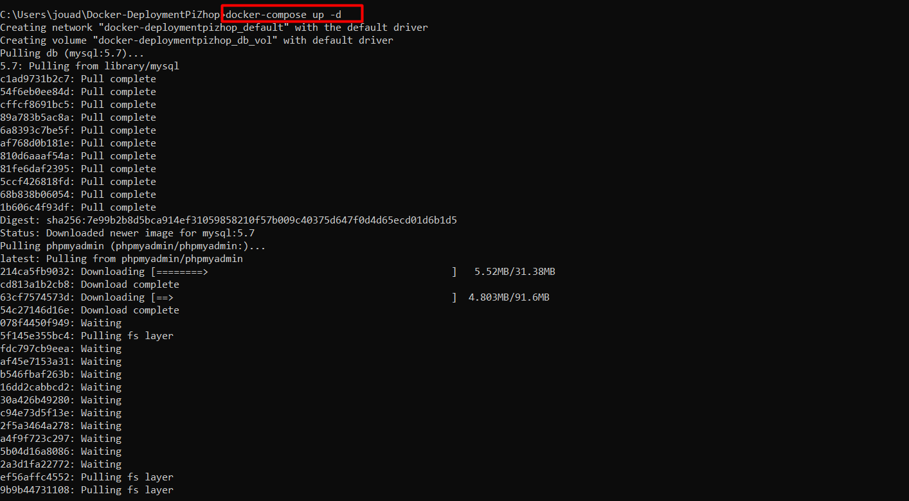
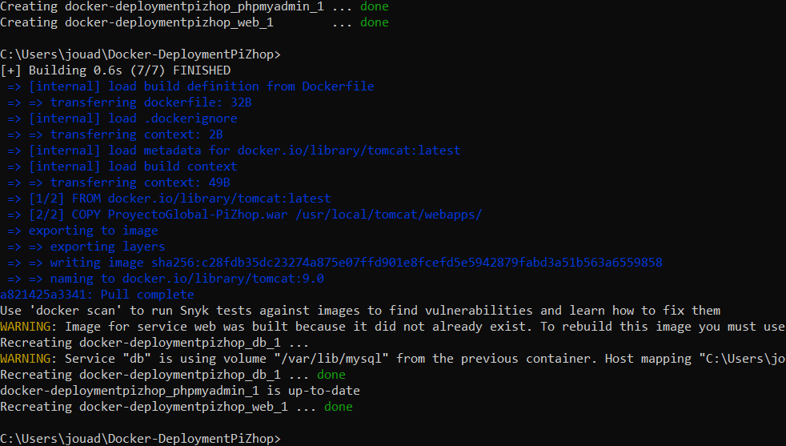
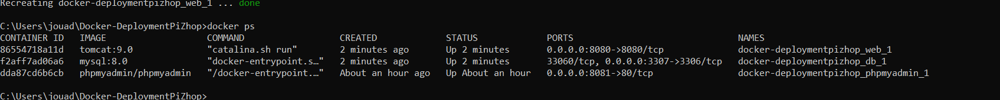
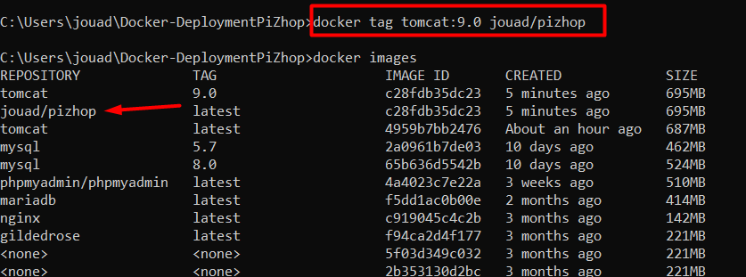
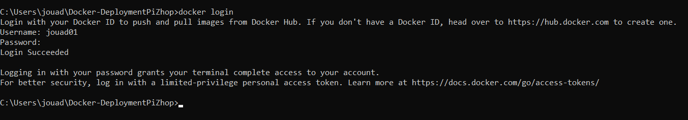
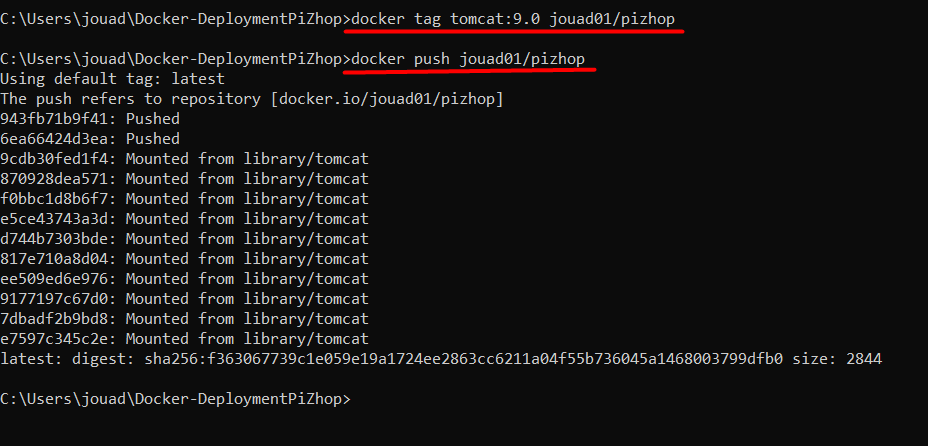
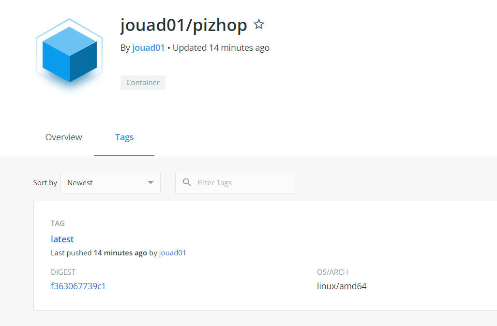

# Docker-DeploymentPiZhop

>Despliegue del proyecto global PiZhop.

## Proceso completo

**El fichero .yml puede variar dependiendo de cada uno**

Una vez creado el fichero dockerfile y docker-compose.yml ejecutamos *docker compose up -d*

Comprobación que ha ido correcto

Podemos ver los contenedores

Creamos una imagen y comprobamos que haya ido bien

Iniciamos sesión con nuestra cuenta a Docker (si no se tiene hay que crearla)

Creamos otra imagen que vaya ligada a nuestro nombre de usuario y hacemos un push.

Podemos ver la imagen en nuestra respectiva cuenta a disposición de cualquier usuario.

**Enlace: https://hub.docker.com/r/jouad01/pizhop**

### Miembros del grupo:

- Jouad El Ouardi
- Daniel Sastre
- Joan Llompart
 
